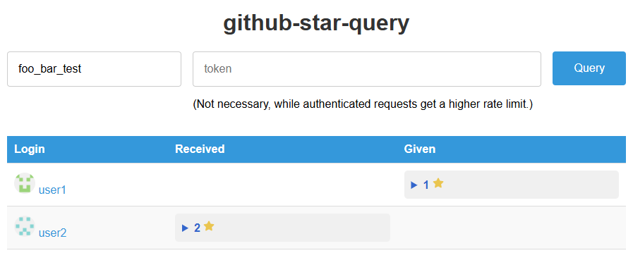

# github-star-query
- A simple web application that allows users to query and display the stars given and received by any GitHub user.

## Features
- Query stars given and received by any GitHub user.
- Display results grouped by users who gave or received the stars.
- Use GitHub API to fetch data, you can input your own token in the input box to increase the rate limit.
- No server-side code, all data processing is done on the client-side.

(The screenshot is a mockup of the API response.)  

### You can try it yourself [Here](https://bartholomew62.github.io/github-star-query/).